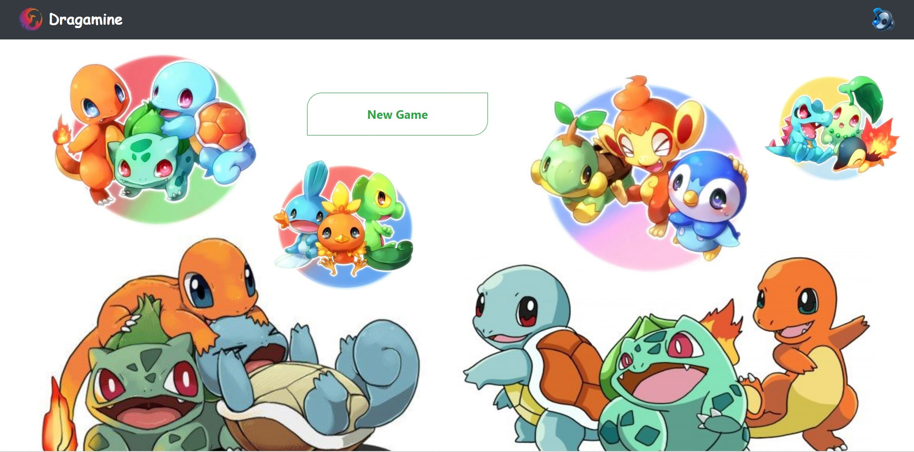
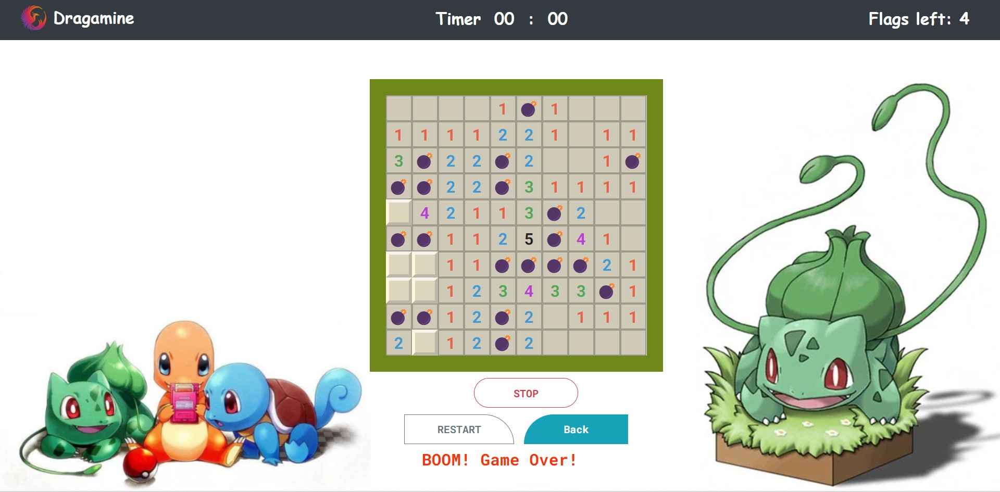

# __Dragamine-Game__

Dragamine is a simple frontend project inspired by the classic game Minesweeper. It consists of a 10x10 grid where each cell can either contain a bomb or a number representing the count of surrounding bombs. The objective of the game is to detect all the bombs by flagging or revealing the cells. The player who successfully identifies all the bombs wins the game.

This project was developed using HTML, CSS, and JavaScript, with a focus on learning about data handling and manipulation using JavaScript. It utilizes a minimalistic tech stack to keep the project simple and easy to understand.

 

## __Features__

- 10x10 Grid: The game board is represented by a 10x10 grid, providing a sufficient challenge for players.

- Bombs and Numbers: Each cell in the grid can either contain a bomb or a number indicating the count of bombs in the surrounding cells.

- Flagging/Unflagging Cells: Players can flag or unflag cells to mark potential bomb locations.

- Revealing Cells: Players can click on cells to reveal their values.

- Win Condition: The game ends when all the bombs are successfully flagged by the player.

 

## __Screenshots__
 

### - *the home page of the game 🏠*
 

 

 

### - *The initial state of the game board 😎*
 

 

 

### - *The demonstrating the flagging feature 🚩*
 

 

 

### - *The process of revealing a cell 💥*
 

 

 

### - *The moment when the game is won 🥳*
 

 

 

## __Getting Started__
 

To play Dragamine, you can access the live version of the project at [Dragamine](https://pragati-c19.github.io/Dragamine-Game/).

Alternatively, if you prefer to run the project locally, follow these steps:

1. Clone the repository:

        git clone https://github.com/Pragati-C19/Dragamine-Game.git

2. Navigate to the project directory:

        cd Dragamine-Game

3. Open the `index.html` file in your preferred web browser.

Feel free to choose the method that suits you best for accessing and playing Dragamine.

 

## __Usage__

- Flagging/Unflagging Cells: Right-click on a cell to flag or unflag it as a potential bomb location.

- Revealing Cells: Left-click on a cell to reveal its value.

- Winning the Game: Flag all the bomb cells to win the game.

 

## __Tech Stack__
 

Dragamine was developed using the following technologies:

- HTML: The project uses HTML for structuring the user interface and defining the game board grid.

- CSS: CSS is used for styling the game elements, including the grid layout, cell appearance, and overall visual presentation.

- JavaScript: The core logic of Dragamine is implemented in JavaScript. It handles data manipulation, game mechanics, and user interactions, such as flagging cells and revealing their values.

By incorporating this tech stack, you were able to create a dynamic and interactive game interface while keeping the project lightweight and straightforward.

 

## __Acknowledgments__
Dragamine was developed as a learning project to gain practical experience with JavaScript data handling and manipulation. Special thanks to the _Minesweeper game_ for providing the inspiration and idea for this project.

 

## __Contact__ 

If you have any questions, suggestions, or feedback, please feel free to contact the project maintainer at pragatichothe@gmail.com

 

_...with ❤️ Pragati_C19_

